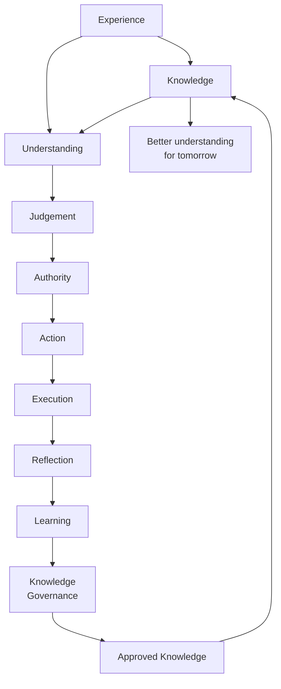

# Companion Intelligence Core

**Status:** Core Architecture Reference

---

> Companion Intelligence Core is the governed cognitive foundation of Helping Hand.
>
> It exists to help people well through accountable understanding, judgement, action, execution, reflection and learning proposal.

---

# Purpose

This document records the completed Companion Intelligence Core as a permanent architectural reference.

It defines:

- the purpose of each cognitive layer
- the contracts between layers
- governance boundaries
- immutable evidence flow
- why Learning cannot change Knowledge directly
- the complete cognitive cycle

This reference is intended for all future Digital Colleagues and contributors.

---

# Scope

This document covers the current governed core:

1. Understanding
2. Judgement
3. Authority
4. Action
5. Execution
6. Reflection
7. Learning

It does not define the future Knowledge Governance implementation itself.

---

# Core Principle

Capability is not permission.

Every transition in the core must preserve:

- human authority
- constitutional constraints
- traceable evidence
- explicit uncertainty
- governed change pathways

---

# Constitutional Principle

Every cognitive layer serves people before it serves technology.

No layer exists to maximise autonomy.

Every layer exists to maximise trustworthy assistance.

Companion Intelligence is therefore governed by five permanent principles:

- explain before deciding
- decide before acting
- record before reflecting
- reflect before learning
- govern before changing knowledge

These principles may not be bypassed by future capabilities.

---

# Layer Purposes

## Understanding Layer

**Purpose:** Form reliable meaning from governed knowledge and context.

Primary output:

- what is currently understood
- confidence in that understanding
- unresolved uncertainty

Understanding explains the situation.

---

## Judgement Layer

**Purpose:** Determine the most appropriate response to formed understanding.

Primary output:

- selected response candidate
- disposition (proceed, caution, human-required, insufficient)
- justification and confidence

Judgement decides what should happen next.

---

## Authority Layer

**Purpose:** Determine whether the judged response is permitted under authority constraints.

Primary output:

- authority decision (allow, allow-with-caution, require-human, deny)
- authority boundaries
- requiresHuman signal
- authority score (autonomous authority remaining, not correctness confidence)

Authority decides whether and how a response may proceed.

---

## Action Layer

**Purpose:** Deterministically merge judgement and authority into a governed action.

Primary output:

- action disposition and state
- executable instruction
- copied boundaries and uncertainty

Action turns judgement + authority into a governed action plan.

---

## Execution Layer

**Purpose:** Record factual runtime outcome of the governed action.

Primary output:

- attempted or not attempted
- observed outcome (succeeded, failed, cancelled, not-attempted)
- effect scope (none, internal, external)
- execution evidence and timing

Execution records what happened, not what should have happened.

---

## Reflection Layer

**Purpose:** Derive findings and recommendations from recorded execution facts.

Primary output:

- findings
- reflection disposition (affirm, adjust, escalate, defer)
- recommendations
- requiresHuman signal

Reflection notices and recommends.

Reflection does not perform change.

---

## Learning Layer

**Purpose:** Convert reflection into a governed learning proposal record.

Primary output:

- learning disposition (reject, observe, propose, reinforce)
- optional proposal
- pending validation state
- copied audit evidence

Learning captures proposed improvement.

Learning does not modify knowledge.

---

# Contracts Between Layers

The core is contract-driven. Each handoff is explicit and typed.

## Understanding -> Judgement

- Input to Judgement: formed understanding, confidence, uncertainty
- Contract intent: judgement is based on what is known and what remains uncertain

## Judgement -> Authority

- Input to Authority: intended action context from judgement
- Contract intent: judged intent must still pass authority controls

## Judgement + Authority -> Action

- Input to Action: judgement record and authority assessment
- Contract intent: most restrictive governed result wins

## Action -> Execution

- Input to Execution: governed action snapshot
- Contract intent: only permitted states may be attempted

## Execution -> Reflection

- Input to Reflection: factual execution record
- Contract intent: reflection derives findings only from recorded facts

## Reflection -> Learning

- Input to Learning: reflection record
- Contract intent: learning stores governed proposals only, never direct changes

---

# Governance Boundaries

## Boundary 1: No Layer Skipping

Later layers must not bypass earlier governance.

Examples:

- Action must not ignore authority denial.
- Execution must not mark blocked actions as attempted.

## Boundary 2: No Silent Escalation Removal

If judgement or authority requires human involvement, downstream layers must preserve that requirement.

## Boundary 3: Reflection Is Advisory

Reflection may recommend change.

Reflection must never directly create or alter knowledge.

## Boundary 4: Learning Is Proposal-Only

Learning creates a proposal for governance review.

Learning must not validate itself.

Learning must not write to knowledge stores.

## Boundary 5: Human Governance Is Explicit

Any critical safety or high-severity governance signal must remain visible and escalate for human review.

---

# Operational Event Model

Companion Intelligence uses one Operational Event model across workflows.

This is the first formal event contract for runtime-to-governance handoff.

Every Operational Event produces an Interaction Record with the canonical seven sections:

- Context
- Decision
- Authority
- Action
- Evidence
- Reflection
- Review Outcome

Example:

Operational Event

Type:
Temperature Recording

Actor:
Chef

Venue:
Anne Arms

Outcome:
Completed

One model.

Many event types.

Initial event taxonomy:

- Temperature Recording
- Cleaning Completed
- Delivery Accepted
- Equipment Fault Reported
- Operational Communications
- Managerial Instruction

Every event type flows through the same governed cycle, evidence model and Interaction Record structure.

## Operational Learning Loop

The architectural learning loop is:

Operational Event
    -> Companion Runtime
    -> Interaction Record
    -> Venue Intelligence
    -> Future Guidance
    -> Better Operational Events
    -> Operational Event (next cycle)

This loop defines how operational reality becomes governed guidance and then returns as improved operation.

Companion Intelligence is not only recording history. It is continuously improving future operation.

This reflects the Helping Hand principle: help people achieve better outcomes today while building better understanding for tomorrow.

Operational Communications should enter this loop as an Operational Event type.

They are not a standalone messaging system in the architecture.

They are governed operational inputs that must produce an Interaction Record and feed Venue Intelligence in the same way as other event types.

---

# Immutable Evidence Flow

Evidence flow is append-only across the core.

Each layer copies upstream records for traceability and isolation.

```
Execution Evidence
        -> Reflection Evidence + Findings + Uncertainty
        -> Learning Audit Evidence + Supporting Evidence Subset
```

Rules:

- do not share mutable object references across layers
- do not rewrite upstream records
- do not fabricate successful outcomes or effects
- keep copied evidence attributable to source context

This preserves audit integrity and reproducibility.

---

# Why Learning Cannot Change Knowledge Directly

Direct write-through from learning to knowledge would collapse governance and remove accountability.

Learning remains proposal-only to preserve:

- human oversight
- validation discipline
- reversible decision points
- provenance and review trace

Required sequence:

```
Reflection
    -> Learning Proposal
    -> Governance Validation
    -> Knowledge Change (if approved)
```

Without this separation, the system becomes self-modifying without constitutional control.

---

# Complete Cognitive Cycle

The completed core cycle is:

```
Understanding
    -> Judgement
    -> Authority
    -> Action
    -> Execution
    -> Reflection
    -> Learning (proposal)
    -> Governance Validation (future capability)
    -> Knowledge Update (only if approved)
```

Short-form intent by step:

- Understanding: explain
- Judgement: choose
- Authority: permit
- Action: govern
- Execution: record
- Reflection: interpret
- Learning: propose
- Governance: approve
- Knowledge: change

---

# Determinism and Auditability

The core should remain deterministic where practical.

Minimum expectations:

- stable timestamp-driven IDs when explicit time is supplied
- deterministic disposition mapping rules
- bounded confidence values between 0 and 1
- explicit reasoning strings for major decisions

Determinism improves testability, safety, and governance review.

---

# Implementation Notes

Current core contracts are represented in:

- lib/understanding
- lib/judgement
- lib/authority
- lib/action
- lib/execution
- lib/reflection
- lib/learning

This document defines architectural intent and operating boundaries for extending those modules.

---

# Extension Rule

Future capabilities may extend this core only if they preserve:

- constitutional alignment
- contract clarity
- evidence immutability
- human governance visibility
- proposal-before-change discipline

Companion Intelligence Core is complete as the governed cognitive foundation of Helping Hand.

Future capabilities extend this foundation.

They do not replace it.

---

# Final Diagram



---

# Version

**Version:** 1.0

This document defines the governed cognitive foundation of Helping Hand.

Future capabilities should extend this architecture without bypassing its constitutional principles, governance boundaries or evidence model.

The cognitive foundation is intended to remain stable while individual Digital Colleagues, professions and capabilities continue to evolve.
