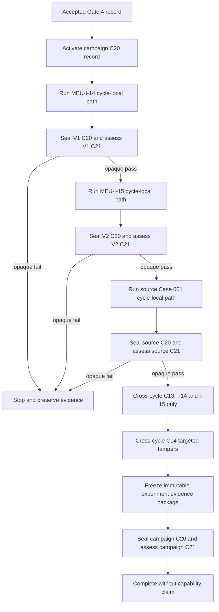

# HH-0000 Multi-Evidence Understanding Case 001 Execution Coordination Correction Design Review

**Status:** EXECUTION COORDINATION CORRECTION DESIGN PROPOSED - COMBINED AUTHORITY ACCEPTANCE REQUIRED
**Review date:** 2026-08-10
**Case:** `MEU-CASE-001`
**Controls:** `MEU-I-14` Semantic Invariance; `MEU-I-15` Evidence Sensitivity
**Review type:** Documentation-only execution coordination correction design
**Correction source:** `docs/formation/HH0000_MULTI_EVIDENCE_UNDERSTANDING_CASE_001_GATE_4_EXECUTION_AUTHORITY_REVIEW.md`
**Accepted boundary authority:** `docs/formation/HH0000_MULTI_EVIDENCE_UNDERSTANDING_CASE_001_IMPLEMENTATION_EVIDENCE_DESIGN_COMBINED_AUTHORITY_REVIEW_V2.md`
**Current implementation evidence:** `docs/formation/HH0000_MULTI_EVIDENCE_UNDERSTANDING_CASE_001_IMPLEMENTATION_EVIDENCE_UPDATE_REVIEW.md`
**Frozen control authority:** `docs/formation/HH0000_MULTI_EVIDENCE_UNDERSTANDING_CASE_001_CONTROL_ARTEFACT_VALIDITY_AND_FREEZE_REVIEW.md`
**Design effect:** Defines the smallest acyclic three-cycle coordinator for Combined Authority assessment
**Implementation effect:** None - no code, test, schema, helper, evaluator, or configuration is changed
**Execution effect:** None - Case 001 and both controls remain blocked
**Artefact effect:** None - all six frozen artefacts and hashes remain unchanged
**Capability effect:** None - no Multi-Evidence Understanding claim is made

## 1. Purpose

This review defines the smallest correction to the circular control-evidence dependency identified when Gate 4 assessed its own authority boundary.

Gate 4 correctly refused to authorise execution because the current runner requires real `MEU-I-14` and `MEU-I-15` outputs before any governed source or control cycle can finish producing those outputs.

That refusal is evidence that the accepted foundations are operating as designed:

1. missing semantic evidence was not promoted to a pass;
2. authority did not override a mechanical contradiction;
3. frozen controls did not become permission merely because they existed;
4. execution remained fail-closed before any source or control candidate invocation;
5. the correction can now be designed before implementation rather than inferred during execution.

## 2. Design Question

> What is the smallest acyclic three-cycle coordination design that can produce cycle-local evidence and post-capture `MEU-I-14` and `MEU-I-15` results without changing semantic ownership, isolation, frozen artefacts, or execution authority?

## 3. Current Defect

The current `runCase001Experiment` path:

1. selects one evidence-cycle identity;
2. captures one candidate and baseline output;
3. invokes `C13` before held-out evaluation and C20/C21 closure;
4. asks `C13` to evaluate every applicable invariant, including `MEU-I-14` and `MEU-I-15`;
5. requires every result to be `passed` before continuing;
6. receives real control accounts only through the already formed `InvariantControls` value.

The graph is circular:


The defect is not an invariant defect. `not-exercised` remains the correct result when real control outputs are absent.

The defect is not an ownership or isolation failure. No semantic operation has moved outside `C07/C08`, and no held-out content has entered candidate input.

The defect is evaluation timing and campaign coordination: cycle-local checks and cross-cycle checks are currently treated as though they have the same dependencies.

## 4. Design Principles

The correction must satisfy all of the following:

1. one bounded experiment run contains three distinguishable evidence cycles;
2. each cycle invokes candidate and baseline at most once;
3. each cycle receives only its own hash-verified runtime fixture;
4. each cycle owns a separate recorder, immutable capture, held-out evaluation, and contamination finding;
5. cycle-local evidence is complete before the next cycle begins;
6. cross-cycle invariants cannot run until all three required captures exist;
7. cross-cycle output cannot feed any candidate, baseline, fixture, prompt, configuration, cache, Memory, prior state, or another cycle;
8. semantic ownership remains solely in `C07/C08`;
9. evaluation remains solely post-output in `C13/C14/C18/C19/C21`;
10. `C22` sees identities, availability, and opaque mechanical statuses only;
11. semantic failure remains evidence and cannot authorise retry, tuning, or a second attempt;
12. mechanical, integrity, ownership, or isolation failure stops further invocation;
13. all frozen paths, bytes, versions, hashes, expected effects, and evaluator-only boundaries remain unchanged;
14. Gate 4 remains blocked until implementation and renewed evidence are separately accepted.

# Part A - Corrected Evidence Graph

## A1. Bounded Experiment Identity

The correction introduces no new semantic capability or fixture. It introduces one mechanical experiment envelope for exactly these existing cycle identities:

1. `MEU-I-14`;
2. `MEU-I-15`;
3. `MEU-CASE-001`.

The order is fixed and not caller-selectable:

```text
MEU-I-14 -> MEU-I-15 -> MEU-CASE-001 -> cross-cycle C13/C14
```

Controls run first so their immutable outputs exist before cross-cycle evaluation, without making either output available to the later source candidate. The controls are already frozen, so this order cannot change their design or held-out expectations.

The order is mechanical, not semantic. `C22` does not inspect output content to select or change it.

## A2. Acyclic Graph



No edge returns from `C13/C14/C18/C19/C21` to any `C01-C12` component.

## A3. Why the Graph Is Acyclic

1. each candidate is invoked before any cross-cycle result exists;
2. each candidate receives only its own deeply immutable fixture clone;
3. each candidate output is captured once and never revised;
4. each cycle-local evaluation depends only on that cycle's fixture, capture, baseline, and held-out assessment;
5. cross-cycle evaluation depends only on the three completed immutable captures;
6. cross-cycle evaluation produces immutable evaluator evidence only;
7. no evaluation result becomes a candidate dependency;
8. no failed result can trigger a retry or changed input.

# Part B - Cycle-Local Contract

## B1. Cycle-Local Invariant Set

The existing applicable invariant set is partitioned by dependency, not weakened.

### Cycle-local invariants

Each cycle evaluates:

`MEU-I-01`, `MEU-I-02`, `MEU-I-03`, `MEU-I-04`, `MEU-I-05`, `MEU-I-06`, `MEU-I-07`, `MEU-I-08`, `MEU-I-09`, `MEU-I-10`, `MEU-I-11`, `MEU-I-12`, `MEU-I-17`, `MEU-I-19`, `MEU-I-21`, `MEU-I-22`, `MEU-I-23`, and `MEU-I-24`.

These invariants depend only on one fixture and its captured candidate account.

### Cross-cycle invariants

Only the post-capture evaluator assesses:

1. `MEU-I-14` against the source and semantic-invariance captures;
2. `MEU-I-15` against the source and evidence-sensitivity captures.

An invariant is not removed, renamed, weakened, defaulted, or treated as passed. It is evaluated only when its required evidence exists.

## B2. Cycle-Local Sequence

Each cycle owns this fixed sequence:

1. `C20` activates a new cycle recorder;
2. `C01` reads only the selected frozen runtime bytes;
3. `C02` verifies the selected runtime hash;
4. `C03` parses literally;
5. `C04` validates structure and references;
6. `C05` creates separate deeply immutable candidate and baseline inputs;
7. `C06` proves their structural equality;
8. `C07/C08` invokes candidate formation once;
9. `C09` invokes accumulation baseline once;
10. `C10/C11` validates output structures;
11. `C12` captures candidate and baseline outputs immutably;
12. cycle-local `C13` evaluates only the cycle-local invariant set;
13. cycle-local `C14` constructs and evaluates only cycle-local targeted tampers;
14. `C19` compares candidate and baseline outputs;
15. `C15` reads only that cycle's held-out bytes after capture;
16. `C16` verifies that held-out hash;
17. `C03` parses literally and `C17` validates structure;
18. `C18` records held-out semantic evaluation;
19. `C20` records handoff and seals the cycle record;
20. `C21` assesses only that sealed cycle record.

## B3. Cycle Completion States

Each cycle returns one immutable state:

1. `COMPLETED_PASS` - mechanical, local invariant, tamper, held-out, baseline, and contamination checks passed;
2. `COMPLETED_SEMANTIC_FAIL` - immutable output and evaluator evidence exist, but one or more semantic checks failed;
3. `STOPPED_MECHANICAL_FAIL` - transport, integrity, validation, capture, or coordinator failure prevented safe completion;
4. `STOPPED_ISOLATION_FAIL` - denied or unenumerated access, feedback, order, or contamination failure occurred;
5. `NOT_STARTED` - an earlier cycle stopped the campaign.

The coordinator sees only the state code. It does not inspect mismatches, findings, account fields, or evaluator rationale.

`COMPLETED_SEMANTIC_FAIL` is evidence, not permission. It ends the campaign without retry and without invoking later candidate cycles. The captured evidence remains available for post-experiment review, but cross-cycle invariants remain `not-exercised` if all three captures were not completed.

## B4. Fail-Closed Finalisation

Once a cycle recorder is activated, every reachable exit must attempt bounded finalisation:

1. record the component and step where failure occurred;
2. record only an opaque failure category, not semantic content;
3. record the `C21` handoff if the recorder remains valid;
4. seal the cycle record exactly once;
5. ask `C21` to assess the sealed facts;
6. preserve honestly when a record cannot be completed rather than inventing a clean finding.

Failure finalisation cannot resume the cycle, invoke held-out access before capture, or turn incomplete evidence into a pass.

# Part C - Cross-Cycle Contract

## C1. Entry Conditions

Cross-cycle `C13/C14` may run only when:

1. all three cycle identities are present exactly once;
2. all three cycles are `COMPLETED_PASS` at cycle-local scope;
3. all three runtime and held-out hashes match their frozen registry values;
4. all three candidate and baseline inputs were equal within their own cycle;
5. all three immutable captures exist;
6. all three held-out evaluations exist;
7. all three cycle C20 records are sealed;
8. all three C21 findings are `clear`;
9. no cycle output or result entered another candidate or baseline input;
10. no duplicate, retry, changed fixture, or unenumerated access occurred.

Missing entry evidence produces `not-exercised`, not pass.

## C2. Cross-Cycle C13

Cross-cycle `C13` receives exactly:

1. the immutable source candidate account;
2. the immutable `MEU-I-14` candidate account;
3. the immutable `MEU-I-15` candidate account;
4. fixed invariant identities and comparison rules already accepted for `MEU-I-14` and `MEU-I-15`.

It does not receive:

1. runtime fixtures or paths;
2. held-out assessments or evaluator rationale;
3. baseline outputs;
4. mutable candidate state;
5. candidate-private helpers;
6. prompts, retrieval, generated context, configuration, cache, Memory, prior state, or external services;
7. Judgement, Authority, or Action inputs.

It produces two separate immutable `InvariantResult` values. One result cannot mask, replace, or average the other.

## C3. Cross-Cycle C14

Cross-cycle `C14` constructs exactly one isolated targeted tamper for each cross-cycle invariant:

1. an `MEU-I-14` wording-dependence tamper;
2. an `MEU-I-15` evidence-insensitivity tamper.

Each tamper:

1. clones an already captured account;
2. changes one named field only;
3. cannot mutate any cycle capture;
4. is assessed through the same cross-cycle evaluator boundary;
5. must make the targeted invariant fail;
6. remains evaluator evidence and cannot feed candidate or baseline.

## C4. No Cross-Cycle Candidate Feedback

The campaign must mechanically prove:

1. all candidate invocations precede cross-cycle evaluation;
2. candidate and baseline dependency closures exclude the campaign package;
3. no capture is converted into runtime input;
4. no evaluator result is written to configuration, cache, log input, Memory, or prior state;
5. no cycle is invoked twice;
6. no candidate is invoked after the first cross-cycle evaluator invocation.

# Part D - C20, C21, and C22

## D1. Separate Cycle Records

Each cycle owns one distinct C20 record with:

1. cycle identity;
2. accepted campaign authority reference;
3. exact component invocation and dependency sequence;
4. actual artifact access and denied-access events;
5. immutable capture event;
6. cycle-local evaluator invocations;
7. held-out access after capture;
8. failure category where applicable;
9. C21 handoff;
10. immutable seal.

One cycle record cannot contain another cycle's account, held-out expectation, semantic result, or recorder events.

## D2. Campaign Record

The experiment envelope owns a fourth C20 record limited to mechanical campaign facts:

1. accepted Gate 4 authority identity;
2. fixed cycle order;
3. cycle start, completion, or stop transitions;
4. uniqueness and no-retry facts;
5. existence of required immutable captures by identity only;
6. cross-cycle C13/C14 invocation and opaque status;
7. immutable package capture;
8. C21 handoff and seal.

The campaign record contains no account fields, held-out expectations, semantic mismatches, or evaluator rationale.

Campaign `C21` assesses:

1. fixed order;
2. one invocation at most per cycle;
3. no candidate invocation after cross-cycle evaluation begins;
4. no cross-cycle feedback;
5. all required cycle records sealed before aggregation;
6. no unenumerated input or access;
7. no retry or output-driven branch.

## D3. C22 Responsibility

`C22` remains `TRANSPORT` and mechanical control. It may:

1. validate that one accepted Gate 4 decision identity exists;
2. invoke the fixed cycle order;
3. route immutable cycle evidence handles without inspecting semantic content;
4. inspect only closed cycle state codes;
5. stop on a non-pass state;
6. invoke cross-cycle C13/C14 only after all entry conditions are mechanically satisfied;
7. assemble the immutable evidence package without changing values;
8. fail closed.

`C22` must not:

1. interpret candidate or baseline output;
2. inspect held-out expectations or mismatches;
3. decide whether an invariant should apply;
4. convert semantic failure into mechanical pass;
5. select a different order, skip a cycle, retry, or tune inputs;
6. call candidate-private helpers;
7. write a result back into candidate, baseline, runtime, configuration, cache, Memory, or prior state;
8. claim capability or execution success from mechanical completion.

# Part E - Immutable Evidence Package

## E1. Package Structure

The final package contains:

1. experiment identity and version;
2. accepted Gate 4 decision identity;
3. fixed ordered cycle identities;
4. three distinct cycle evidence records;
5. for each cycle, runtime hash, candidate and baseline input digests, immutable capture, cycle-local invariant results, targeted-tamper results, baseline comparison, held-out hash, held-out evaluation, sealed C20 record, and C21 finding where reached;
6. two cross-cycle invariant results where exercised;
7. two cross-cycle targeted-tamper results where exercised;
8. sealed campaign C20 record;
9. campaign C21 finding;
10. overall mechanical evidence status;
11. explicit `not-exercised` markers for evidence whose prerequisites were not reached.

## E2. Package Rules

1. the package is deeply immutable;
2. each cycle remains distinguishable by identity;
3. missing evidence is represented explicitly and never defaulted;
4. semantic failures remain separate from mechanical and contamination failures;
5. no aggregate score, pass percentage, confidence average, or capability label is created;
6. no failed result is hidden by another passed result;
7. no concise conclusion replaces structured evidence;
8. package creation authorises no retry, implementation change, or downstream effect.

# Part F - Failure and Stop Rules

## F1. Immediate Campaign Stop

The campaign stops before another candidate invocation on:

1. absent or non-permitting Gate 4 authority;
2. duplicate or out-of-order cycle identity;
3. frozen hash mismatch;
4. structural or referential validation failure;
5. candidate and baseline input inequality;
6. candidate or baseline mutation;
7. output validation or capture failure;
8. cycle-local invariant or tamper failure;
9. held-out access before capture;
10. held-out hash, structure, or semantic evaluation failure;
11. baseline comparison boundary failure;
12. recorder, seal, or C21 failure;
13. contamination or unenumerated access;
14. any attempted feedback, retry, dynamic reordering, or second invocation.

Where safe finalisation is possible, the current cycle record and campaign record are sealed and assessed before stop. No later cycle begins.

## F2. Cross-Cycle Stop

Cross-cycle evaluation is `not-exercised` if any entry condition is absent.

After entry, the package records failure if:

1. `MEU-I-14` fails or remains indeterminate;
2. `MEU-I-15` fails or remains indeterminate;
3. either cross-cycle targeted tamper is not detected;
4. campaign C20/C21 finds feedback, duplication, reordering, or contamination.

No cross-cycle failure permits retry or another candidate invocation.

# Part G - Focused Evidence Required Before Gate 4 Returns

The later implementation evidence update must establish without executing Case 001 or either real control:

1. exact cycle-local and cross-cycle invariant partitions;
2. no invariant ID is omitted, duplicated, renamed, or weakened;
3. fixed three-cycle order and uniqueness;
4. immediate refusal for a non-permitting Gate 4 decision;
5. synthetic completion of all three cycles and post-capture cross evaluation;
6. synthetic stop at each cycle and campaign transition;
7. no later cycle after a failed status;
8. one candidate and one baseline invocation at most per cycle;
9. independent immutable fixture clones and captures;
10. separate held-out access order and hash verification per cycle;
11. separate C20 seal and C21 assessment per cycle;
12. campaign-level chronology, no-retry, and no-feedback evidence;
13. cross-cycle evaluator closure excludes candidate, filesystem, held-out, prompt, retrieval, configuration, cache, Memory, prior state, and external services;
14. cross-cycle results cannot feed candidate or baseline;
15. cycle-local and cross-cycle targeted tampers each fail their named invariant;
16. incomplete captures produce `not-exercised`, never pass;
17. immutable package preserves every result separately;
18. all six frozen hashes remain unchanged and mismatch refusal still passes;
19. existing candidate, baseline, evaluator, and artifact dependency closures remain accepted;
20. typecheck and focused test suite pass.

No test may invoke `formMultiEvidenceUnderstanding`, baseline, or held-out evaluation with the real source or control fixtures.

# Part H - Authority Review

## H1. MARC Questions - Humanity / Formation

MARC must assess whether:

1. three independent formations preserve dignity, attribution, privacy, and unknown internal state;
2. control-first order cannot influence the later source candidate;
3. semantic failure remains honest evidence rather than a reason to tune or repeat;
4. direct accounts remain attributable in every cycle;
5. missing or stopped evidence remains visibly `not-exercised`;
6. post-capture comparison does not become a hidden upstream interpretation;
7. no Judgement, response, communication, intervention, Authority, or Action is introduced;
8. the immutable package remains an evidence record rather than a claim about the person or capability.

## H2. Cyril Questions - Digital / Technology / Platform

Cyril must assess whether:

1. the graph is acyclic;
2. cycle-local and cross-cycle invariant partitions are complete and disjoint;
3. all component classifications remain valid;
4. no new component or unnamed responsibility is introduced;
5. every cycle owns separate C20/C21 evidence;
6. campaign C20/C21 remains mechanical and non-semantic;
7. C22 receives only closed identities, immutable handles, and opaque states;
8. cross-cycle C13/C14 is post-capture only and has no feedback edge;
9. failure finalisation cannot resume or widen execution;
10. the immutable package preserves complete distinguishable evidence;
11. focused synthetic evidence can falsify order, uniqueness, isolation, and completeness claims;
12. Gate 4 remains impossible before renewed implementation evidence and authority review.

## H3. Required Combined Authority Decision

A separate Combined Authority review must record exactly one:

1. `EXECUTION COORDINATION CORRECTION DESIGN BLOCKED`;
2. `EXECUTION COORDINATION CORRECTION DESIGN REQUIRES CORRECTION`;
3. `EXECUTION COORDINATION CORRECTION DESIGN ACCEPTED - BOUNDED IMPLEMENTATION MAY BEGIN`.

This document cannot accept itself.

# Part I - Permission Boundary

## I1. Current Permission

This review permits only:

1. documentation validation of this design;
2. a separate MARC and Cyril Combined Authority review of this design.

It does not permit:

1. implementation or test changes;
2. passing an execution-permitting decision to any runner;
3. invoking candidate, baseline, invariant, held-out evaluator, or full experiment paths with any real source or control fixture;
4. changing or rehashing any frozen artefact;
5. creating new fixtures, controls, expected effects, prompts, models, retrieval, generated context, configuration, cache, Memory, prior state, or external services;
6. ordinary runtime integration, Talk.Get, natural input, live use, Learning, Knowledge write, Judgement, Authority, Action, communication, or intervention;
7. retries, tuning, repeated attempts, or observation-driven code change;
8. capability, milestone, certification, production-readiness, or live-use claims.

## I2. Re-entry Conditions

Return to architecture or Combined Authority if:

1. a new semantic owner or component classification is required;
2. a control output must enter another candidate or baseline input;
3. cross-cycle evaluation needs candidate-private logic or held-out content;
4. cycle-local and cross-cycle invariant ownership cannot remain distinct;
5. separate cycle C20/C21 records cannot remain isolated;
6. the campaign recorder must inspect semantic content;
7. failure evidence cannot be preserved without resuming execution;
8. a frozen artefact or hash changes;
9. prompts, retrieval, generated context, configuration behavior, external services, cache, Memory, or prior state become necessary;
10. Judgement, Authority, Action, or another entrusted responsibility becomes materially implicated.

## I3. Exact Next Step

Conduct a documentation-only MARC and Cyril Combined Authority review of this correction design.

Do not implement the correction. Do not execute Case 001 or either control. Do not return to Gate 4 until:

1. Combined Authority accepts the design;
2. the accepted correction is implemented;
3. focused non-execution implementation evidence passes;
4. a new implementation evidence update accepts the correction.

## I4. Validation Boundary

Documentation validation may establish only:

1. required sections and decisions are present;
2. repository references resolve;
3. the design is internally consistent at the documentation level;
4. no frozen identity is changed by this review.

No runtime, candidate, baseline, evaluator, invariant, control, or execution test is required or authorised by this documentation-only step.

## Traceability

**Principle:** `constitution/02-CONSTITUTION.md`; `constitution/05-AUTHORITY-AND-STEWARDSHIP.md`; truth, evidence before claims, dignity, bounded authority, and access following authority remain controlling.
**Theory:** `docs/theory/002-THEORY-OF-KNOWLEDGE.md`; `docs/theory/003-THEORY-OF-UNDERSTANDING.md`; `docs/theory/004-THEORY-OF-JUDGEMENT.md`; `docs/theory/007-THEORY-OF-CONTEXT.md`.
**Architecture:** The accepted Multi-Evidence Understanding architecture; accepted Case 001 v2 boundary map; `MEU-I-14`; `MEU-I-15`; cycle-local evidence; separate sealed cycles; post-capture evaluation.
**Engineering:** Proposed only - fixed three-cycle coordination, cycle-local/cross-cycle invariant partition, separate cycle and campaign C20/C21 records, immutable package, fail-closed transitions, and focused synthetic evidence requirements.
**Milestone:** Not Applicable - no implementation, execution, formation, milestone, certification, capability completion, production readiness, or live use is claimed.
**Evidence:** Gate 4 correction decision, current implementation source, accepted implementation evidence update, frozen control review, and the directly observed circular dependency. Combined Authority acceptance, corrected implementation, renewed implementation evidence, semantic outputs, execution records, and capability evidence remain absent.